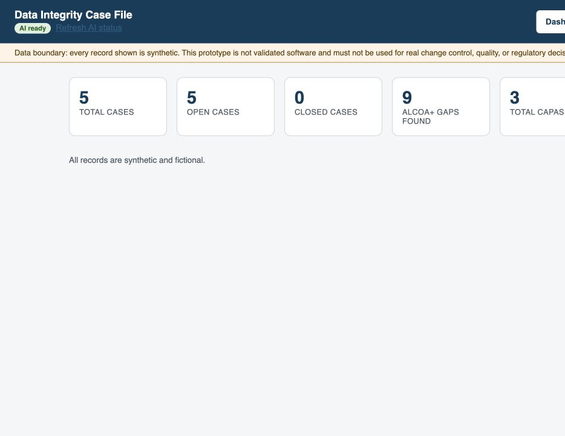
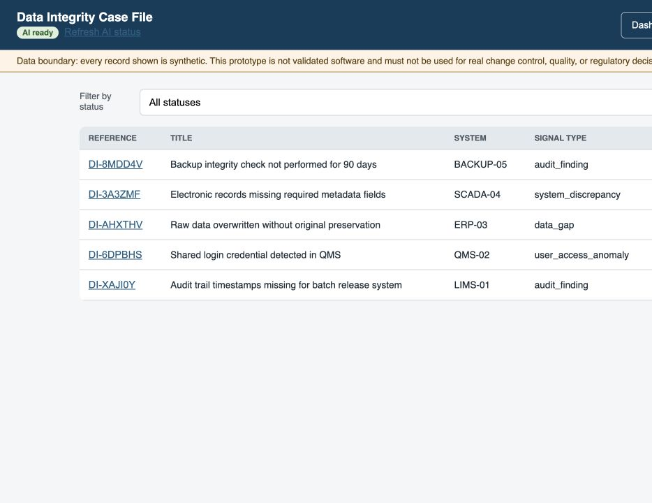

# Data Integrity Case File

<div align="center">

[](https://github.com/alianisreyesr/data-integrity-case-file/actions/workflows/ci.yml)
[](https://github.com/alianisreyesr/data-integrity-case-file/actions/workflows/codeql.yml)
[](https://github.com/alianisreyesr/data-integrity-case-file)
[](https://www.python.org/)
[](https://fastapi.tiangolo.com/)
[](https://react.dev/)
[](https://www.sqlite.org/)
[](https://ollama.com/)
[](docs/REGULATORY_REFERENCES.md)
[](docker-compose.yml)

**ALCOA+ · Data Integrity · Investigation · CAPA Readiness · Audit Evidence · Local AI Triage**

*Portfolio-safe prototype — synthetic data only*

[Screenshots](#portfolio-preview) · [Quick start](#quick-start) · [Case study](docs/CASE_STUDY.md) · [Investigation playbook](docs/INVESTIGATION_PLAYBOOK.md) · [AI Assistant](docs/AI_ASSISTANT.md) · [Security](SECURITY.md)

</div>

---

> **Data boundary:** All case files and evidence notes are fictional. This is an educational workspace and must not be used for actual regulatory filings, batch releases, or official QA investigations.

---

## Portfolio preview

| Investigation summary | Synthetic case library |
|---|---|
|  |  |

See the [case study](docs/CASE_STUDY.md) for the business problem, users, decisions, evidence, and production boundary.

## What This Is

An investigative workspace modeling how quality and IT compliance professionals structure **data integrity investigations** under ALCOA+ and 21 CFR Part 11:

1. **Intake** — Capture the signal (audit finding, system discrepancy, user access anomaly)
2. **ALCOA+ gap analysis** — Evaluate affected attributes: Attributable, Legible, Contemporaneous, Original, Accurate, Complete, Consistent, Enduring, Available
3. **Evidence log** — Record audit trail reviews, technical metadata, access logs, screenshots, interview notes
4. **Root cause & CAPA formulation** — Structure corrective and preventive action items
5. **AI-assisted triage** — Local LLM (Ollama + `llama3.2:3b`) suggests which ALCOA+ attributes to prioritize — human review required for every suggestion
6. **Workflow lifecycle** — Track case stages from intake through QA closure

Designed to demonstrate fluency in FDA, MHRA, and PIC/S data integrity frameworks through clean software architecture.

**Stack:** Python 3.11 · FastAPI 0.141 · Pydantic v2 · SQLite (WAL) · React 19 · Docker Compose · Ollama (local AI) · GitHub Actions

---

## Security (local demo)

This is **not** production IAM. Controls are intentional for a portfolio prototype:

| Control | Behavior |
|---------|----------|
| **API key** | Header `X-API-Key` required on all routes except `/health`, `/docs`, `/redoc`, `/openapi.json` |
| **Default key** | `dev-api-key-change-me` — override with env `API_KEY` |
| **Rate limit** | 120 req/min per client (default); AI suggest endpoint 10 req/min |
| **Security headers** | `X-Frame-Options`, `X-Content-Type-Options`, CSP, `Referrer-Policy` |
| **CORS** | Allowlist: `localhost:5173` / `127.0.0.1:5173` |
| **Audit actor** | Mutations still require `X-Actor` for the application audit log |
| **Ollama** | Published only on `127.0.0.1:11434` on the host |
| **Container** | API image runs as non-root user `appuser` |

```bash
# Examples
curl http://localhost:8000/health
curl -H "X-API-Key: dev-api-key-change-me" http://localhost:8000/summary
curl -H "X-API-Key: $API_KEY" -H "X-Actor: A.Reyes" \
  -H "Content-Type: application/json" \
  -d '{"title":"Demo case","system":"LIMS-01","signal_type":"audit_finding","opened_by":"A.Reyes"}' \
  http://localhost:8000/cases
```

Env vars (API / Compose): `API_KEY`, `RATE_LIMIT_DEFAULT`, `RATE_LIMIT_WINDOW_SECONDS`, `RATE_LIMIT_AI`, `RATE_LIMIT_AI_WINDOW_SECONDS`.

---

## Quick Start

### Option A — Docker Compose (recommended)

```bash
# 1. Clone
git clone https://github.com/alianisreyesr/data-integrity-case-file.git
cd data-integrity-case-file

# 2. Optional: set a non-default API key
export API_KEY=dev-api-key-change-me

# 3. Start all services (API + frontend + Ollama)
docker compose up --build

# 4. Verify (health is public; other routes need the key)
curl http://localhost:8000/health
curl -H "X-API-Key: $API_KEY" http://localhost:8000/ai/status
```

> **Ollama note:** Model pull runs via the `ollama-init` one-shot service. Data persists in the `ollama_data` volume.

### Option B — Local Python (no Docker)

```bash
# 1. Prerequisites: Python 3.11+, Ollama installed (https://ollama.com)
ollama pull llama3.2:3b

# 2. Install dependencies
python -m venv .venv && source .venv/bin/activate
pip install -r requirements-dev.txt

# 3. Seed synthetic data
python data/seed.py

# 4. Run (optional: export API_KEY=...)
uvicorn app.main:app --reload
# API: http://localhost:8000
# Docs: http://localhost:8000/docs
```

---

## API Endpoints

All endpoints below except `GET /health` require **`X-API-Key`**. Write operations also require **`X-Actor`**.

### Core Workflow

| Method | Path | Description |
|--------|------|--------------| 
| `GET` | `/health` | Service health + data boundary reminder (public) |
| `GET` | `/summary` | Case counts, open gaps, CAPA stats |
| `GET` | `/cases` | List all cases (filter by `?status=`) |
| `POST` | `/cases` | Open a new DI case |
| `GET` | `/cases/{id}` | Get case detail |
| `GET` | `/cases/{id}/alcoa-gaps` | List ALCOA+ gap assessments |
| `POST` | `/cases/{id}/alcoa-gaps` | Record a gap finding |
| `GET` | `/cases/{id}/evidence` | List evidence entries |
| `POST` | `/cases/{id}/evidence` | Add an evidence record |
| `GET` | `/cases/{id}/capas` | List CAPAs for a case |
| `POST` | `/cases/{id}/capas` | Create a CAPA item |
| `GET` | `/audit-log` | Full audit log (filter by `?case_id=`) |

### AI-Assisted Triage (Human Review Required)

| Method | Path | Description |
|--------|------|--------------| 
| `GET` | `/ai/status` | Ollama service + model availability check |
| `POST` | `/cases/{id}/ai-suggest-gaps` | Generate ALCOA+ gap suggestions (local LLM; stricter rate limit) |
| `GET` | `/cases/{id}/ai-suggestions` | List all AI suggestions for a case |
| `POST` | `/ai-suggestions/{id}/review` | Accept / reject / modify full suggestion set |
| `GET` | `/ai-suggestions/{id}/items` | List per-attribute suggestions with review status |
| `POST` | `/ai-suggestions/{id}/items/{idx}/review` | Review a single suggestion item |

> **Interactive docs:** `http://localhost:8000/docs` (Swagger UI)

---

## AI Layer

The local AI assistant uses `llama3.2:3b` via Ollama running **entirely on your machine** — no data leaves your environment.

```
User opens case → POST /ai-suggest-gaps
                      ↓
              ai.py calls Ollama /api/chat
                      ↓
         LLM returns JSON: [{attribute, risk_level, rationale}]
                      ↓
         Response hashed (SHA-256) + stored in ai_suggestions
                      ↓
     Qualified human reviews each item: accepted / rejected / modified
                      ↓
              Decision logged to audit_log
```

The AI **never writes directly to case records**. Every suggestion requires explicit human action before any gap is recorded. The hash ensures the stored response is bitwise-identical to what the model returned.

See [`docs/AI_ASSISTANT.md`](docs/AI_ASSISTANT.md) for the full design rationale.

---

## Project Structure

```
data-integrity-case-file/
├── app/
│   ├── main.py              # FastAPI app, lifespan, middleware, routers
│   ├── security.py          # API key, rate limit, security headers
│   ├── router.py            # Core REST endpoints
│   ├── models.py            # Pydantic v2 request/response models
│   ├── database.py          # SQLite connection + schema init (WAL mode)
│   ├── ai.py                # Ollama client, prompt, response validation
│   ├── ai_status.py         # GET /ai/status — readiness check
│   └── ai_item_reviews.py   # Per-item human review endpoints + DB init
├── data/
│   └── seed.py              # Synthetic case data seeder
├── tests/
│   ├── test_api.py          # Core workflow endpoint tests
│   ├── test_security.py     # API key + rate limit tests
│   ├── test_ai.py           # AI module unit tests
│   ├── test_ai_contract.py  # JSON contract / schema tests
│   └── test_ai_status.py    # Ollama status endpoint tests
├── docs/
│   ├── AI_ASSISTANT.md
│   ├── REGULATORY_REFERENCES.md
│   ├── ROADMAP.md
│   └── FRONTEND_AI_AUDIT_AND_ROADMAP.md
├── frontend/                # React 19 investigation board
├── Dockerfile               # Non-root appuser
├── docker-compose.yml
└── requirements.txt
```

---

## Roadmap

| Phase | Milestone | Status |
|-------|-----------|--------|
| Phase 0 | Documentation & ALCOA+ regulatory map | ✅ Complete |
| Phase 1 | Case, Finding, Evidence & CAPA domain models + AI layer | ✅ Complete |
| Phase 2 | FastAPI endpoints & synthetic case library | ✅ Complete |
| Phase 2.1 | API key, rate limits, security headers, non-root Docker | ✅ Complete |
| Phase 3 | Investigation board & detail reviewer UI (React 19) | ✅ Complete |
| Phase 4 | Extended test suite, CodeQL scanning & hardened Docker delivery | ✅ Complete |

---

## Regulated Portfolio Ecosystem

| Project | Domain Focus | Evidence |
|---------|-------------|----------|
| [GxP Change Control](https://github.com/alianisreyesr/gxp-change-control) | Controlled change lifecycle & approvals | v1.0.0 · 68 tests · CI/CD |
| [Quality Deviation Risk Monitor](https://github.com/alianisreyesr/quality-deviation-risk-monitor) | Deviation prioritization & scoring | 57 tests · Append-only audit |
| [CSV Evidence Tracker](https://github.com/alianisreyesr/csv-evidence-tracker) | RTM & IQ/OQ/PQ execution patterns | ALCOA+ verified evidence |
| [CSA Assurance Planner](https://github.com/alianisreyesr/csa-assurance-planner) | Risk-based software assurance planning | FDA CSA alignment |
| [GxP Batch Data Pipeline](https://github.com/alianisreyesr/gxp-batch-data-pipeline) | Batch manufacturing data pipeline | DuckDB · dbt · quality gates |

---

## Running Tests

```bash
# Unit + contract + security tests (no Ollama required — Ollama calls are mocked)
export API_KEY=test-api-key   # tests also set this internally
pytest tests/ -v

# With coverage
pytest tests/ --cov=app --cov-report=term-missing
```

> AI tests mock the Ollama HTTP call so the full test suite runs offline.

---

## Resumen en Español

Espacio de trabajo educativo para **investigaciones de integridad de datos** bajo el marco ALCOA+: captura de hallazgos → análisis de brechas → registro de evidencias de pistas de auditoría → formulación de CAPA → cierre de calidad. Incluye una capa de **IA local** (Ollama, `llama3.2:3b`) que sugiere atributos ALCOA+ a investigar — toda sugerencia requiere revisión humana explícita antes de registrarse. La API usa **X-API-Key** y rate limiting; los datos son sintéticos y no certifican cumplimiento oficial.

---

<div align="center">

Built by [Alianis Reyes-Reyes](https://github.com/alianisreyesr) · [LinkedIn](https://www.linkedin.com/in/alianis-reyes-reyes/) · [Portfolio](https://poplme.co/hash/aJvjFE0Z/1/es)

</div>
