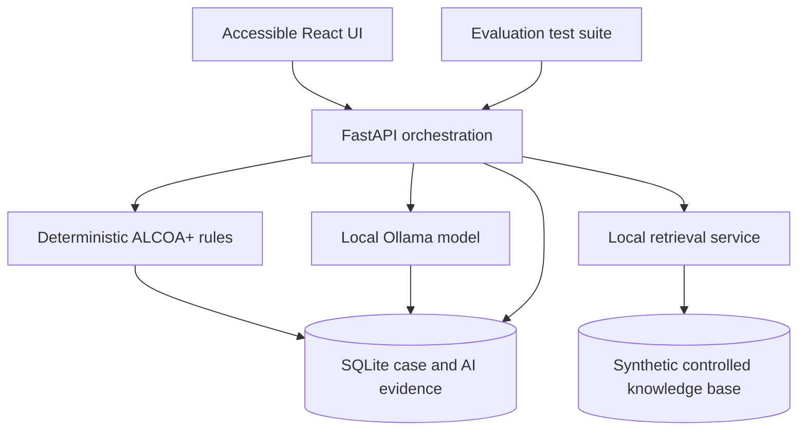

# Frontend and AI Audit & Innovation Roadmap

## Audit Scope

This document reviews the repository state after the React frontend, WCAG-oriented
accessibility improvements, local Ollama integration, and human-in-the-loop AI
suggestion workflow.

## Current Baseline

- FastAPI and SQLite API, React, TypeScript, and Vite frontend, and Docker Compose
  services for the API, frontend, and Ollama.
- Case intake, ALCOA+ assessments, evidence, CAPAs, activity evidence, synthetic
  seed data, and API tests.
- Local AI suggestions stored with model name, provider, prompt version, response
  hash, UTC generation timestamp, and human-review fields.
- A UI workflow that lets a reviewer generate suggestions and record accepted,
  rejected, or modified status.
- All project documentation must remain in English.

## Strengths

1. **Human-in-the-loop boundary.** AI does not write ALCOA+ assessments directly.
2. **Traceability.** Generation and review are distinct audit events.
3. **Local-by-design model service.** Ollama is reachable from the API through the
   Docker Compose network.
4. **Accessible foundation.** The frontend uses semantic landmarks, keyboard-operable
   case selection, visible focus treatment, table headers and captions, fieldsets,
   and status and error announcements.
5. **Recruiter-ready architecture.** The project is an end-to-end containerized
   application rather than an isolated model demo.

## Audit Findings and Priorities

### P0 — Resolve Before Portfolio Release

| Finding | Risk | Remediation | Acceptance criteria |
|---|---|---|---|
| CI needs to prove frontend compilation as well as Python tests. | A TypeScript or Vite regression could be merged even when API tests pass. | Add Node setup, `npm ci`, and `npm run build` to CI. | CI fails on a TypeScript or Vite build error. |
| Local model availability is manual. The Ollama service can start without the configured model, producing a 503 until a manual pull completes. | Confusing first-run behavior and inconsistent demos. | Add an explicit model bootstrap/init service or a documented one-command setup plus readiness endpoint. | The UI reports model state as Ready, Downloading, or Unavailable without attempting a generation. |
| AI output is structurally checked, but attribute and risk values should be constrained to the application vocabulary. | A model can return unsupported ALCOA+ attributes or risk labels. | Use `Literal` or Enum validation and reject unexpected values. | Invalid model output is not persisted and produces a controlled 502 or 503 response. |
| The review status applies to an entire AI response, not each suggested attribute. | One response may contain multiple recommendations that need different human decisions. | Normalize suggestions into individual reviewable records or add per-item review rows. | A reviewer can accept one attribute and reject another from the same generation. |

### P1 — High-Value Product and Assurance Work

| Improvement | Outcome |
|---|---|
| Convert an accepted suggestion into a pre-filled, still editable ALCOA+ assessment draft. | Preserves human control while reducing duplicate entry. |
| Add explicit reviewer comment and modified-rationale fields. | Makes the `modified` decision meaningful and reviewable. |
| Store a prompt hash and a model/runtime metadata snapshot. | Improves reproducibility and traceability. |
| Add an AI status endpoint and a frontend availability indicator. | Makes degraded mode understandable. |
| Add Playwright smoke tests and axe accessibility checks. | Tests the user-visible workflow and accessibility automatically. |
| Add responsive table behavior and a mobile audit pass. | Makes the UI usable at smaller viewport widths. |
| Add frontend error boundaries and a reusable inline status component. | Prevents one API failure from obscuring the entire view. |

### P2 — Portfolio Differentiation and Innovation

| Innovation | Value | Guardrail |
|---|---|---|
| Evidence-grounded RAG over synthetic policies and ALCOA+ guidance. | The model can cite approved synthetic source snippets instead of relying only on a prompt. | Show source chunks; do not represent output as regulatory advice. |
| Explainable risk rubric. | Combine deterministic rules with model rationale and display rule and model contributions separately. | Rules take precedence; the model cannot override risk controls. |
| Prompt and model evaluation suite. | Compare model versions against a curated synthetic test set of expected ALCOA+ suggestions. | Publish accuracy and consistency limitations rather than claiming validation. |
| Audit-log anomaly monitor. | Flag unusual sequence, volume, or timing patterns using deterministic rules first. | Alerts are review tasks, not automated findings. |
| Review analytics dashboard. | Show suggestion acceptance, rejection, modification rates, and common ALCOA+ themes. | Use aggregate synthetic data only. |

## Recommended Delivery Sequence

### Sprint 1 — Reliability and Testability

1. Add a backend model-status and readiness endpoint.
2. Add an Ollama model bootstrap strategy.
3. Constrain AI output with application enums.
4. Expand CI to run `pytest`, the frontend build, and Docker configuration validation.
5. Add tests for an unavailable model, malformed model output, unsupported attribute,
   and unsupported risk level.

### Sprint 2 — Human Review Workflow

1. Split AI generation into individual suggestion records.
2. Add per-item accept, reject, and modify actions and mandatory reviewer comments
   for modify and reject actions.
3. Add a pre-filled, editable ALCOA+ draft from an accepted suggestion.
4. Add audit events for every state transition.
5. Add UI feedback, keyboard behavior, and frontend tests.

### Sprint 3 — Grounded AI Innovation

1. Create a small synthetic knowledge base with source IDs and versioning.
2. Implement retrieval with local embeddings and a local vector store.
3. Require each model suggestion to cite retrieved source IDs.
4. Add an evaluation dataset and scripted regression tests.
5. Add a Model Card and an AI Assurance Plan in English.

## Proposed Architecture Evolution

## Definition of Done for v0.2.0

- The full application starts with a documented local command and reports AI readiness.
- CI passes Python tests, frontend production build, accessibility smoke checks, and
  model-output contract tests.
- Every AI recommendation is independently reviewable and never creates a controlled
  record automatically.
- Review action, reviewer, timestamp, prompt version and hash, model identifier,
  response hash, and source references are traceable.
- The README and AI documentation are English-only and state that this is a
  synthetic-data, non-validated portfolio prototype.

## Out of Scope

Real regulated data, production authentication, electronic signatures, Part 11
compliance claims, autonomous CAPA decisions, and claims that the application is
validated software are out of scope for this portfolio prototype.
